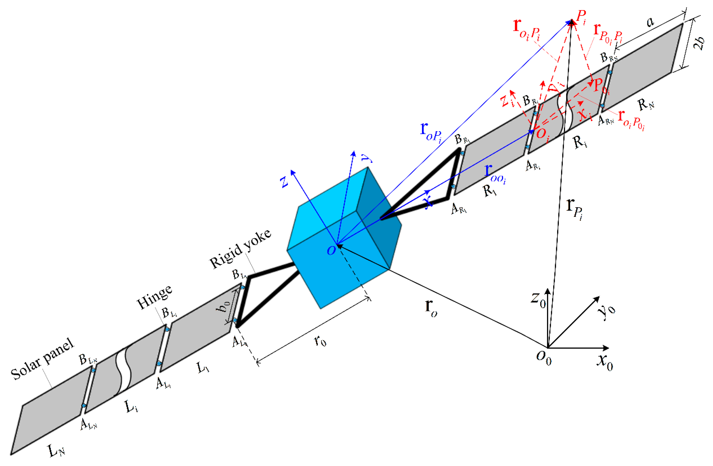

# Spacecraft Dynamics and Control Specialization

  

    
This repository will contain useful material used in the course <strong>Spacecraft Dynamics and Control Specialization</strong> at the University of Colorado Boulder.

    
The materials include code, lectures, and assignments relevant to spacecraft dynamics and control systems.

    
Feel free to explore the resources provided and make use of them for learning purposes!

  

  

    
  

